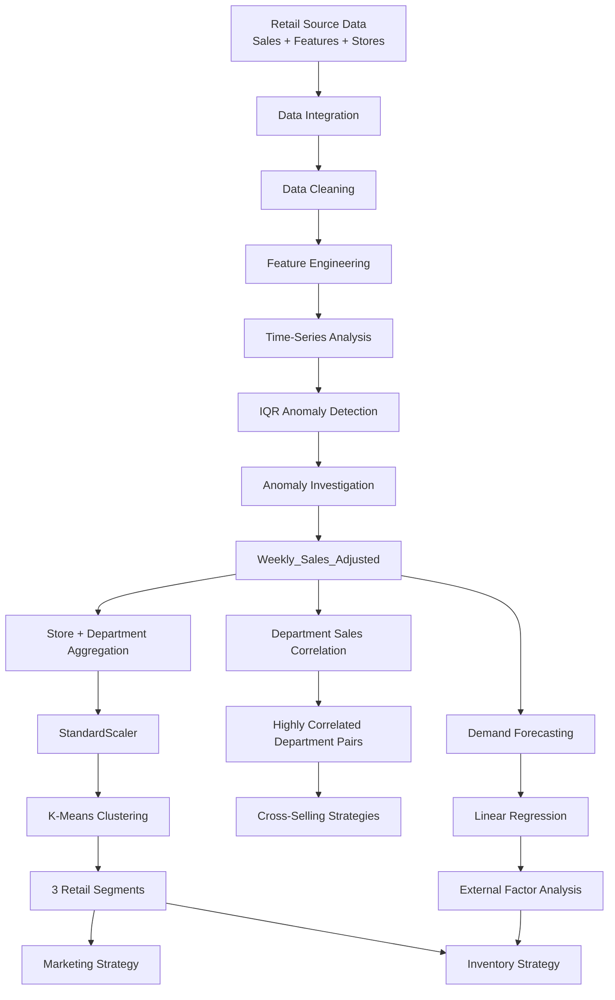

# 🏪 Integrated Retail Analytics for Store Optimization

<p align="center">
  <b>An end-to-end retail analytics project for anomaly detection, store segmentation, demand forecasting, cross-selling, marketing, and inventory optimization.</b>
</p>

<p align="center">
  
  
  
  
  
  
  
</p>

---

## 📌 Table of Contents

- [Overview](#-overview)
- [Business Objective](#-business-objective)
- [Project Workflow](#-project-workflow)
- [System Architecture](#-system-architecture)
- [Source Data](#-source-data)
- [Data Preparation](#-data-preparation)
- [Feature Engineering](#-feature-engineering)
- [1. Time-Series Analysis & Anomaly Detection](#1--time-series-analysis--anomaly-detection)
- [2. Anomaly Investigation & Handling](#2--anomaly-investigation--handling)
- [3. Store & Department Segmentation](#3--store--department-segmentation)
- [4. Department Correlation & Cross-Selling](#4--department-correlation--cross-selling)
- [5. Demand Forecasting](#5--demand-forecasting)
- [6. Personalized Marketing Strategies](#6--personalized-marketing-strategies)
- [7. Inventory Management Strategies](#7--inventory-management-strategies)
- [Key Results](#-key-results)
- [Project Structure](#-project-structure)
- [Setup](#-setup)
- [How to Run](#-how-to-run)
- [Limitations](#-limitations)
- [Future Improvements](#-future-improvements)
- [Author](#-author)

---

## 🚀 Overview

This project builds an **integrated retail analytics workflow** that combines historical sales, store information, promotional activity, and external economic factors to support store-level business decisions.

The notebook combines multiple analytics techniques into a single pipeline:

```text
Raw Retail Data
      │
      ▼
Data Integration
      │
      ▼
Data Cleaning
      │
      ▼
Feature Engineering
      │
      ├───────────────► Time-Series Analysis
      │                        │
      │                        ▼
      │                 Anomaly Detection
      │                        │
      │                        ▼
      │                 Anomaly Handling
      │
      ├───────────────► Store / Department Segmentation
      │                        │
      │                        ▼
      │                 K-Means Clustering
      │
      ├───────────────► Department Correlation
      │                        │
      │                        ▼
      │                 Cross-Selling Strategy
      │
      └───────────────► Demand Forecasting
                               │
                               ▼
                    Marketing + Inventory Strategy
```

The result is a business-oriented analytics framework rather than an isolated machine learning model.

---

## 🎯 Business Objective

The project is designed to answer practical retail questions such as:

- How do sales behave over time?
- Which sales records are unusual?
- What factors may be associated with sales anomalies?
- Which stores/departments have similar characteristics?
- Which departments have strongly correlated sales?
- How can correlated departments be used for cross-selling?
- How accurately can sales be forecast?
- Which external factors influence sales predictions?
- How should marketing strategies differ across store segments?
- How should inventory policies differ across store segments?

---

# 🔄 Project Workflow

The notebook follows this sequence:

```text
1. Merge Retail Data
        ↓
2. Handle Missing Values
        ↓
3. Feature Engineering
        ↓
4. Time-Series Analysis
        ↓
5. IQR-Based Anomaly Detection
        ↓
6. Investigate Anomaly Causes
        ↓
7. Adjust Anomalous Sales
        ↓
8. Store/Department Feature Aggregation
        ↓
9. K-Means Segmentation
        ↓
10. Silhouette Evaluation
        ↓
11. Department Sales Correlation
        ↓
12. Cross-Selling Recommendations
        ↓
13. Demand Forecasting
        ↓
14. External-Factor Analysis
        ↓
15. Personalized Marketing Strategy
        ↓
16. Inventory Optimization Strategy
```

---

# 🏗️ System Architecture



> GitHub renders Mermaid diagrams directly inside Markdown.

---

# 📂 Source Data

The notebook starts with three DataFrames:

```text
sales_date
features_data
stores_data
```

These are merged into a single analytical DataFrame:

```text
df_merged
```

The merge process uses:

- `Store`
- `Date`

for the sales/features integration and:

- `Store`

for joining store-level information.

The notebook converts `Date` columns to datetime before performing these operations.

---

# 🧹 Data Preparation

## Missing Values

The notebook identifies missing values and specifically handles the `MarkDown` fields:

```text
MarkDown1
MarkDown2
MarkDown3
MarkDown4
MarkDown5
```

Missing values in these columns are replaced with:

```text
0.0
```

The notebook interprets missing markdown information as no markdown activity.

It reports no other missing values requiring additional imputation.

---

# 🛠️ Feature Engineering

The following time-related features are extracted from `Date`:

```text
Year
Month
Week
DayOfWeek
```

The `Type` field is converted into numerical features through one-hot encoding.

The resulting encoded variables include:

```text
StoreType_B
StoreType_C
```

These engineered features are then available for time-series analysis, segmentation, and forecasting.

---

# 1. 📈 Time-Series Analysis & Anomaly Detection

## Monthly Sales Trends

The notebook sets `Date` as the time-series index and resamples sales at a monthly frequency.

The primary metric is:

```text
Weekly_Sales
```

Monthly mean sales are calculated and visualized to identify:

- trend
- seasonality
- unusual periods

---

## Holiday Impact

Average weekly sales are compared between:

```text
Holiday Weeks
Non-Holiday Weeks
```

### Reported result

| Period | Average Weekly Sales |
|---|---:|
| Holiday | **$17,035.82** |
| Non-Holiday | **$15,901.45** |

This indicates higher average weekly sales during holiday periods in the analyzed data.

---

## IQR-Based Anomaly Detection

Anomalies are detected separately for each:

```text
Store + Dept
```

The notebook calculates:

```text
Q1
Q3
IQR = Q3 - Q1
```

and defines:

```text
Lower Bound = Q1 - 1.5 × IQR
Upper Bound = Q3 + 1.5 × IQR
```

Any `Weekly_Sales` outside the corresponding store-department bounds is marked:

```text
IsAnomaly = True
```

### Result

The notebook identifies:

```text
18,056 anomalous Weekly_Sales records
```

---

# 2. 🔎 Anomaly Investigation & Handling

The project investigates anomalies using:

- holiday status
- markdown activity
- temperature
- fuel price

## Holiday Influence

Reported anomaly distribution:

```text
Holiday anomalies     = 2,969
Non-holiday anomalies = 15,087
```

This suggests that holidays contribute to anomalies but are not the primary explanation for most anomalous observations.

---

## Promotional Activity

The notebook finds substantial markdown activity during anomalous sales periods.

Examples of reported ranges include:

```text
MarkDown1 → up to $75,149.79
MarkDown3 → up to $141,630.61
```

This suggests promotional activity is an important potential driver of unusual sales patterns.

---

## Temperature

Anomalies occur across a broad temperature range:

```text
Minimum ≈ -2.06°F
Maximum ≈ 100.14°F
```

No single temperature pattern is identified as the dominant explanation.

---

## Fuel Price

Anomalous observations occur across:

```text
$2.472 → $4.468
```

Again, the notebook does not identify one isolated fuel-price level as the main anomaly driver.

---

## Anomaly Handling Strategy

Instead of deleting anomalous records, the notebook caps abnormal `Weekly_Sales` values at their corresponding:

```text
Lower Bound
or
Upper Bound
```

The cleaned value is stored in:

```text
Weekly_Sales_Adjusted
```

### Result

All:

```text
18,056
```

identified anomalies are adjusted.

This preserves the observations while reducing the influence of extreme values on downstream analysis.

---

# 3. 🏬 Store & Department Segmentation

## Feature Preparation

Data is aggregated by:

```text
Store
Dept
```

The clustering features include the mean of:

```text
Weekly_Sales_Adjusted
MarkDown1
MarkDown2
MarkDown3
MarkDown4
MarkDown5
CPI
Unemployment
Fuel_Price
Size
```

The `Store` and `Dept` identifiers themselves are excluded from the clustering feature matrix.

---

## Feature Scaling

Because the variables have different numeric ranges, the notebook applies:

```python
StandardScaler()
```

This creates:

```text
X_scaled
```

for clustering.

---

## Selecting the Number of Clusters

The project uses the **Elbow Method** to compare:

```text
K = 1 ... several candidate values
```

The notebook observes that the reduction in inertia begins to slow after:

```text
K = 3
```

Therefore:

```text
Optimal K = 3
```

is selected as a practical clustering configuration.

---

## K-Means Segments

The three segments are interpreted as:

<details>
<summary><b>🟢 Cluster 0 — High Sales, Large Stores, High Markdowns</b></summary>

**Average Weekly Sales**

```text
$19,231.33
```

**Average Store Size**

```text
186,579.50 sq ft
```

Key characteristics:

- Highest average sales
- Largest stores
- Highest markdown usage
- Lowest unemployment: `7.34`
- Moderate CPI: `198.09`
- Moderate fuel price: `3.27`

**Business interpretation:** high-performing, large-capacity stores with strong promotional activity.

</details>

<details>
<summary><b>🟡 Cluster 1 — Low Sales, Small Stores, Low Markdowns</b></summary>

**Average Weekly Sales**

```text
$6,151.23
```

**Average Store Size**

```text
60,065.26 sq ft
```

Key characteristics:

- Lowest average sales
- Smallest stores
- Lowest markdown activity
- Moderate CPI: `184.52`
- Moderate unemployment: `7.98`
- Moderate fuel price: `3.29`

**Business interpretation:** smaller stores with lower sales volumes and relatively limited promotional activity.

</details>

<details>
<summary><b>🔵 Cluster 2 — Medium Sales, Medium-Large Stores, Medium Markdowns</b></summary>

**Average Weekly Sales**

```text
$14,831.81
```

**Average Store Size**

```text
141,580.87 sq ft
```

Key characteristics:

- Medium sales
- Medium-large store size
- Medium markdown usage
- Lowest CPI: `137.27`
- Highest unemployment: `8.53`
- Highest fuel price: `3.49`

**Business interpretation:** stores with intermediate performance operating in comparatively challenging economic conditions.

</details>

---

## Segmentation Quality

The notebook evaluates clustering using the:

```text
Silhouette Score
```

### Reported score

```text
0.2526
```

This provides a quantitative measure of cluster separation and cohesion for the chosen three-segment solution.

---

# 4. 🛒 Department Correlation & Cross-Selling

The project investigates whether departments within the same store show correlated sales behavior.

## Method

For each store:

1. Departments are aligned by date.
2. `Weekly_Sales_Adjusted` is pivoted.
3. Correlation matrices are calculated across departments.
4. Department pairs with correlation greater than:

```text
0.7
```

are extracted.

---

## Result

The notebook identifies:

```text
4,277 highly correlated department pairs
```

across all stores.

Many pairs show correlations close to:

```text
1.0
```

which indicates strong positive sales co-movement.

---

## Cross-Selling Strategies

The notebook proposes several actions.

### 1. Product Placement

Place highly correlated departments closer together.

Example:

```text
Department A
     ↕
Department B
```

The goal is to make complementary products easier to discover.

### 2. Bundle Offers

Create packages combining products from correlated departments.

### 3. Personalized Recommendations

Use historical department relationships to recommend related products.

### 4. Promotions

Run coordinated promotions across correlated categories.

### 5. Inventory Coordination

Forecast demand for correlated departments together so that one department does not run out while the complementary department has excess stock.

---

# 5. 📦 Demand Forecasting

The notebook builds a baseline forecasting model for:

```text
Store 1
Department 1
```

## Target

```text
Weekly_Sales_Adjusted
```

## Features

The forecasting model uses variables including:

```text
Year
Month
Week
IsHoliday_x
Temperature
Fuel_Price
CPI
Unemployment
MarkDown1
MarkDown2
MarkDown3
MarkDown4
MarkDown5
Size
IsAnomaly
```

---

## Baseline Model

The notebook uses:

```text
Linear Regression
```

The data is split into training and testing sets based on time rather than randomly.

This helps maintain the chronological structure of the forecasting task.

---

## Baseline Results

| Metric | Result |
|---|---:|
| MAE | **$2,720.31** |
| RMSE | **$3,001.49** |

These metrics represent the baseline forecasting performance for the analyzed Store 1 / Department 1 series.

---

# 🌦️ External Factors in Forecasting

The notebook analyzes Linear Regression coefficients to understand the relationship between external factors and predicted sales.

### Most influential reported factors

| Feature | Coefficient |
|---|---:|
| `IsAnomaly` | **+11,291.66** |
| `Year` | **-7,131.70** |
| `Fuel_Price` | **+2,672.03** |
| `Unemployment` | **-2,639.71** |
| `CPI` | **+1,185.86** |

Markdown variables show relatively smaller direct linear effects in this baseline model.

---

## Interpretation

### `IsAnomaly`

The strongest positive coefficient indicates unusual events can have a large effect on sales predictions.

### `Year`

The negative coefficient suggests a downward temporal pattern in the modeled series.

### `Fuel_Price`

The positive coefficient indicates that higher fuel-price observations are associated with higher predicted sales in this particular fitted model.

### `Unemployment`

The negative coefficient indicates an inverse relationship with predicted sales in the baseline model.

### `CPI`

The positive coefficient may reflect higher nominal sales during periods with higher CPI.

> These coefficients describe relationships learned by the baseline Linear Regression model. They should not automatically be interpreted as causal effects.

---

# 6. 🎯 Personalized Marketing Strategies

The project converts the segmentation results into actionable marketing recommendations.

<details>
<summary><b>Cluster 0 — High Sales / Large Stores / High Markdowns</b></summary>

Recommended direction:

- Enhanced loyalty programs
- Cross-promotional campaigns
- Personalized offers
- High-visibility promotional events
- Greater use of department correlation insights

The strategy focuses on maximizing the strong sales potential of large, high-performing stores.

</details>

<details>
<summary><b>Cluster 1 — Low Sales / Small Stores / Low Markdowns</b></summary>

Recommended direction:

- Community-centric engagement
- Local partnerships
- Niche product positioning
- Personalized customer service
- In-store experiences

The strategy focuses on customer loyalty and local relevance rather than aggressive discounting.

</details>

<details>
<summary><b>Cluster 2 — Medium Sales / Medium-Large Stores / Medium Markdowns</b></summary>

Recommended direction:

- Value-oriented promotions
- Clear savings messaging
- Seasonal campaigns
- Event-based promotions
- Strategic markdown planning

The strategy focuses on value and affordability in markets characterized by higher unemployment and lower CPI in the cluster analysis.

</details>

---

# 7. 📦 Inventory Management Strategies

The project combines clustering and forecasting insights to propose inventory policies.

<details>
<summary><b>Cluster 0 — Dynamic & Aggressive Inventory Management</b></summary>

Recommended approach:

- Higher safety-stock levels
- Dynamic reorder points
- Larger order quantities where appropriate
- Promotion-aware inventory forecasting
- Additional stock planning for holiday periods
- Greater integration of markdown schedules with inventory planning

The strategy reflects high sales volumes, large stores, and strong promotional activity.

</details>

<details>
<summary><b>Cluster 1 — Lean Inventory Management</b></summary>

Recommended approach:

- Lower safety-stock levels
- Smaller and more frequent orders
- Focus on core products
- Conservative promotional inventory
- Minimize holding costs
- Consider vendor-managed inventory where appropriate

The strategy reflects smaller store capacity and lower sales volume.

</details>

<details>
<summary><b>Cluster 2 — Balanced Inventory Management</b></summary>

Recommended approach:

- Moderate safety stock
- Flexible reorder points
- Mix of medium and small order quantities
- Strategic promotional inventory
- Stronger attention to economic conditions
- Seasonal adjustments around holidays

The strategy balances demand opportunities with inventory risk.

</details>

---

# 📊 Key Results

| Area | Result |
|---|---:|
| Holiday Avg. Weekly Sales | **$17,035.82** |
| Non-Holiday Avg. Weekly Sales | **$15,901.45** |
| Detected Sales Anomalies | **18,056** |
| Adjusted Anomalies | **18,056** |
| Optimal K | **3** |
| Silhouette Score | **0.2526** |
| Highly Correlated Department Pairs | **4,277** |
| Forecast MAE | **$2,720.31** |
| Forecast RMSE | **$3,001.49** |

---

# 🧠 Business Insights

### Sales & Seasonality

Holiday weeks show higher average sales than non-holiday weeks, making holiday periods important for demand and inventory planning.

### Promotions

Large markdown values appear frequently around anomalous sales periods, indicating promotional activity is an important factor in unusual sales behavior.

### Store Segmentation

Three distinct operational profiles are identified:

```text
Cluster 0 → High Sales / Large / High Markdowns
Cluster 1 → Low Sales / Small / Low Markdowns
Cluster 2 → Medium Sales / Medium-Large / Medium Markdowns
```

### Department Relationships

The presence of 4,277 highly correlated department pairs suggests that cross-department sales relationships may support:

- bundled offers
- coordinated promotions
- store-layout optimization
- complementary product recommendations

### Forecasting

The baseline Linear Regression model provides a starting point, but there is significant opportunity to improve accuracy using more advanced time-series and machine-learning approaches.

---

# 📁 Project Structure

```text
integrated-retail-analytics/
│
├── 📓 Integrated_Retail_Analytics_for_Store_Optimization_.ipynb
│
├── 📊 Data
│   ├── sales_date
│   ├── features_data
│   └── stores_data
│
├── 🔎 Analysis
│   ├── EDA
│   ├── Time-Series Analysis
│   ├── Anomaly Detection
│   └── Anomaly Investigation
│
├── 🏬 Segmentation
│   ├── Feature Aggregation
│   ├── StandardScaler
│   ├── Elbow Method
│   ├── K-Means
│   └── Silhouette Score
│
├── 🛒 Cross-Selling
│   └── Department Correlation Analysis
│
├── 📈 Forecasting
│   └── Linear Regression
│
├── 🎯 Business Strategy
│   ├── Marketing Strategy
│   └── Inventory Strategy
│
└── 📘 README.md
```

---

# 💻 Setup

## Install Dependencies

```bash
pip install pandas numpy matplotlib seaborn scikit-learn jupyter
```

## Optional Google Colab

The notebook can be opened directly in Google Colab.

Recommended environment:

```text
Python 3.x
Pandas
NumPy
Scikit-learn
Matplotlib
Seaborn
```

---

# ▶️ How to Run

### 1. Open the notebook

Open:

```text
Integrated_Retail_Analytics_for_Store_Optimization_.ipynb
```

in Jupyter Notebook, JupyterLab, or Google Colab.

### 2. Load the source data

Load the three project DataFrames:

```text
sales_date
features_data
stores_data
```

### 3. Execute the workflow

Run the notebook sequentially:

```text
Data Merge
   ↓
Missing Values
   ↓
Feature Engineering
   ↓
Time-Series Analysis
   ↓
Anomaly Detection
   ↓
Anomaly Handling
   ↓
Segmentation
   ↓
Correlation Analysis
   ↓
Forecasting
   ↓
Marketing Recommendations
   ↓
Inventory Recommendations
```

---

# 🔬 Reproducibility

The segmentation stage uses:

```text
StandardScaler
K-Means
```

with three clusters selected from the Elbow Method.

The forecasting stage uses a chronological train/test strategy for the Store 1 / Department 1 forecasting example.

The anomaly detection stage uses:

```text
1.5 × IQR
```

on a per:

```text
Store + Department
```

basis.

---

# ⚠️ Limitations

<details>
<summary><b>Anomaly detection</b></summary>

The IQR method is effective for identifying extreme observations but does not establish whether an observation is truly erroneous. Some anomalies may represent legitimate promotional or seasonal demand spikes.

</details>

<details>
<summary><b>Forecasting</b></summary>

The Linear Regression model is a baseline model for one Store/Department series. Its performance should not be generalized to all stores or departments.

</details>

<details>
<summary><b>Clustering</b></summary>

The Silhouette Score of `0.2526` indicates that the three clusters provide only moderate separation. Additional clustering approaches may produce different business segments.

</details>

<details>
<summary><b>Correlation analysis</b></summary>

Correlation identifies co-movement rather than causation. Highly correlated department sales do not necessarily mean that purchasing one department causes purchases in another.

</details>

<details>
<summary><b>External factors</b></summary>

Regression coefficients represent associations within the fitted model and should not be treated as causal estimates without additional experimental or econometric analysis.

</details>

---

# 🚀 Future Improvements

## Forecasting

Potential improvements include:

- ARIMA
- Prophet
- Gradient Boosting
- Random Forest
- XGBoost
- LSTM
- Hierarchical forecasting across store/department levels

## Anomaly Detection

Possible improvements:

- Isolation Forest
- Local Outlier Factor
- Seasonal decomposition
- Robust time-series models
- Automated anomaly alerting

## Segmentation

Possible improvements:

- Gaussian Mixture Models
- DBSCAN
- Hierarchical clustering
- PCA before clustering
- Automated cluster selection using multiple metrics

## Recommendations

Possible improvements:

- Collaborative filtering
- Market-basket analysis
- Association-rule mining
- Customer-level personalization
- Product-level recommendation

## Productionization

Possible extensions:

```text
Data Pipeline
     ↓
Scheduled Processing
     ↓
Automated Model Training
     ↓
Model Tracking
     ↓
Model Deployment
     ↓
Monitoring
     ↓
Automated Retraining
```

---

# 🧩 End-to-End Business Value

The project connects analytics directly to operational decisions:

```text
Anomaly Detection
      ↓
Cleaner Sales Data
      ↓
Better Segmentation
      ↓
Better Forecasting
      ↓
Targeted Marketing
      ↓
Improved Inventory Planning
      ↓
More Informed Store Optimization
```

This makes the project useful not only for demonstrating machine learning techniques, but also for demonstrating how analytical results can support real retail decision-making.

---

# 👨‍💻 Author

**Dhananjay Kumar Sharma**

Interests:

- Data Science
- Machine Learning
- Deep Learning
- Analytics
- AI Engineering
- MLOps

---

# 🔗 Project Reference

The uploaded notebook references the following GitHub project:

[Integrated Retail Analytics for Store Optimization](https://github.com/rahul99554/Integrated-Retail-Analytics-for-Store-Optimization)

---

# ⭐ Support

If you find this project useful, consider giving the repository a ⭐ and exploring the notebook for the complete implementation.

---

## 📄 License

Add your preferred open-source license here, for example:

```text
MIT License
```
